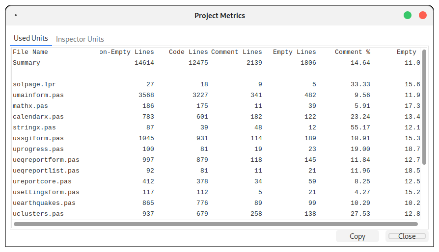
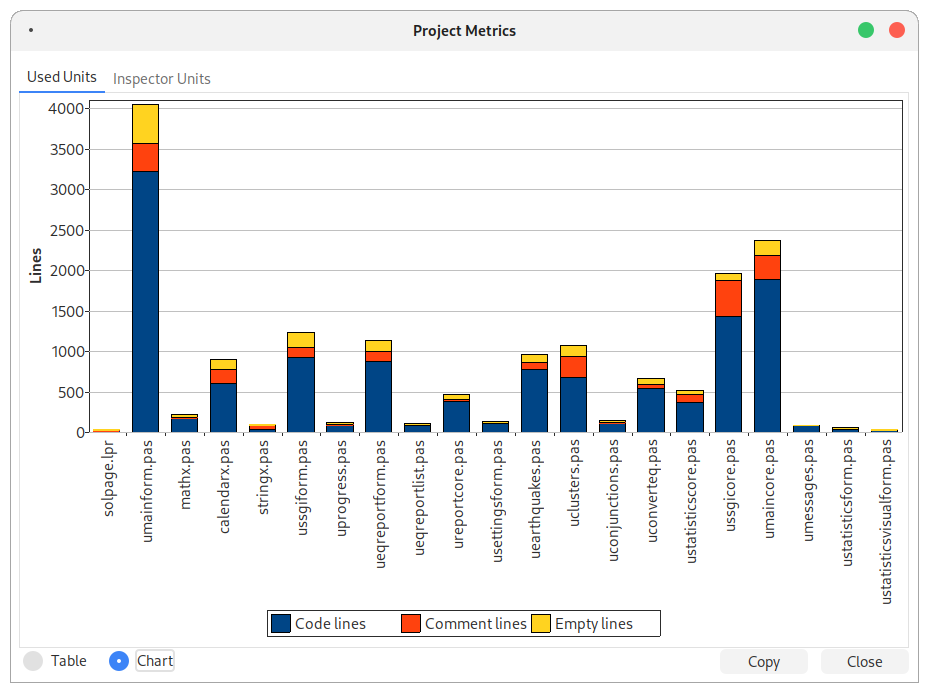

# Project Metrics

This is a Lazarus IDE extension that adds a "Project Metrics..." item to the Project menu. It shows information about the current project, the used units and various total line counts, in a dialog.

## Features

* Adds "Project Metrics..." to the Project menu in Lazarus IDE.
* Shows:
  * Total line counts of the project.
  * Line counts per file.
  * Used units and Inspector units.
* Dialog has a Close button to exit.

## Requirements

* Lazarus IDE version 3.2 or higher.
* Needed packages (already in Lazarus):
  * IDEIntf (for IDE features).
  * LCL (for the dialog).

## How to Install

1. Get the package:
   * Download from GitHub: Click the green "Code" button and select "Download ZIP".
   * Or clone with Git:
     ```bash
     git clone https://github.com/ssgeos/ProjectMetrics.git
     ```

2. Open in Lazarus:
   * Go to Package > Open Package File (.lpk).
   * Find ProjectMetrics/projectmetrics.lpk and open it.

3. Install:
   * Click Install and say yes to rebuild the IDE.
   * Lazarus will restart with the extension added.

4. Check it works:
   * Go to Project > Project Metrics... to see the dialog.

## How to Use

* Open a Lazarus project.
* Click Project > Project Metrics... in the menu.
* The dialog shows:
  * Used Units and Inspector Units
  * Total line count of the project
  * Total comment lines
  * Total empty lines
  * Percentage of comment lines
  * Percentage of empty lines
  * Same metrics per file
  * Copy buttom to copy the metrics to the clipboard 
* Click Close to close the dialog.

## Notes

* Tested with Lazarus 3.2 on Debian and 4.0 on Windows 11.
* The menu item appears at the end of the Project menu.
* To edit the dialog, use a temporary Lazarus project.

### Files

* projectmetrics.lpk: Package file.
* uprojectmetrics.pas: Adds the menu item.
* ProjectMetricsDlg.pas: Dialog logic.
* ProjectMetricsDlg.lfm: Dialog design.

### Testing

* Must be tested in the Lazarus IDE (rebuild required).
* For dialog changes:
  1. Create a new Lazarus project.
  2. Add ProjectMetricsDlg.pas and .lfm to edit in the form designer.
  3. Copy files back to the package and rebuild.

It was successfuly installed in Lazarus 3.2 on Debian 12 and Windows 7, and in Lazarus 4.0 on Windows 11.

## License

MLGPL License (see LICENSE file).

## Contact

* Author: [Frank Hoogerbeets]
* GitHub: https://github.com/ssgeos
* Questions? Post on the Lazarus Forum: https://forum.lazarus.freepascal.org

## Screenshots


Linux


Linux Chart


Windows 7
